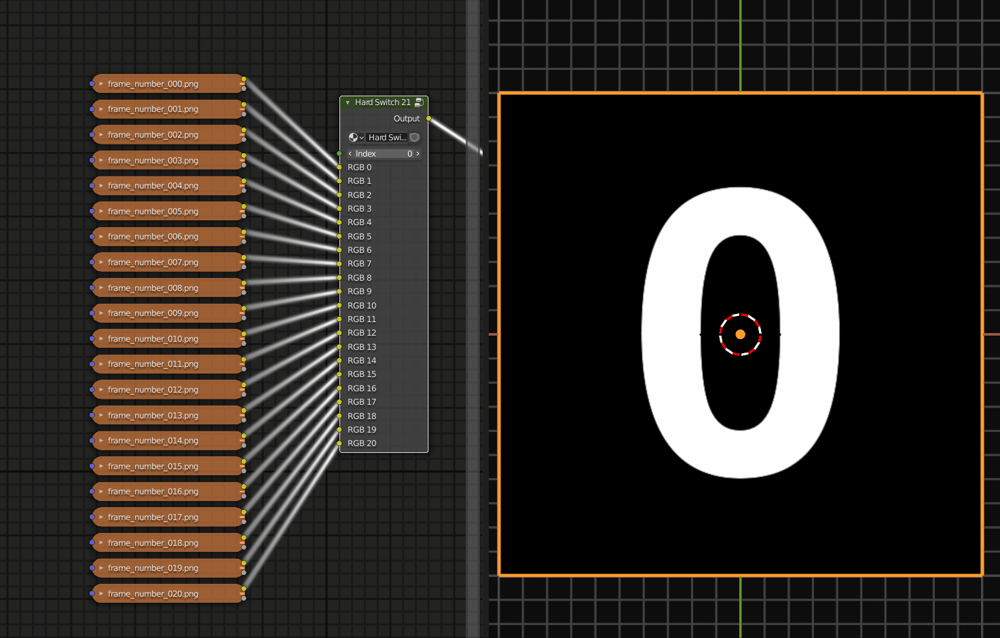
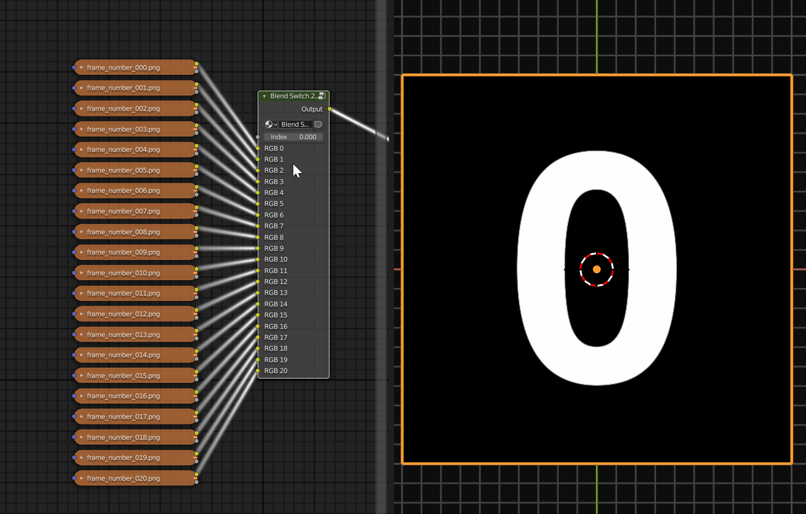
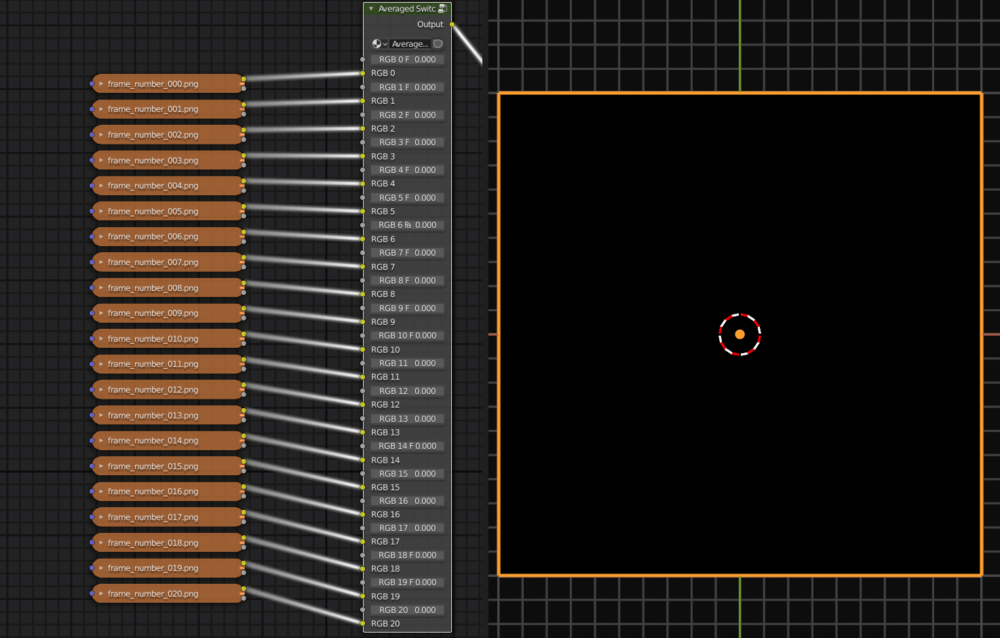
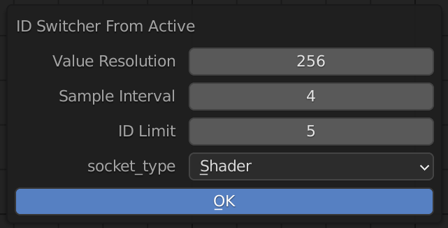
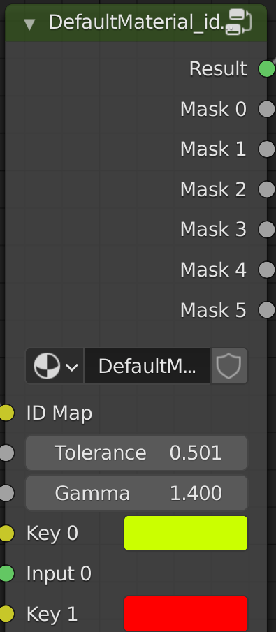
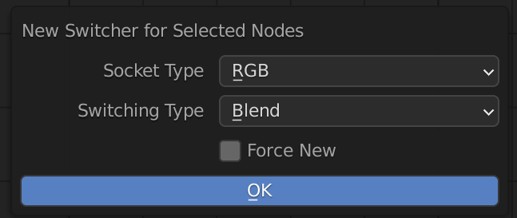
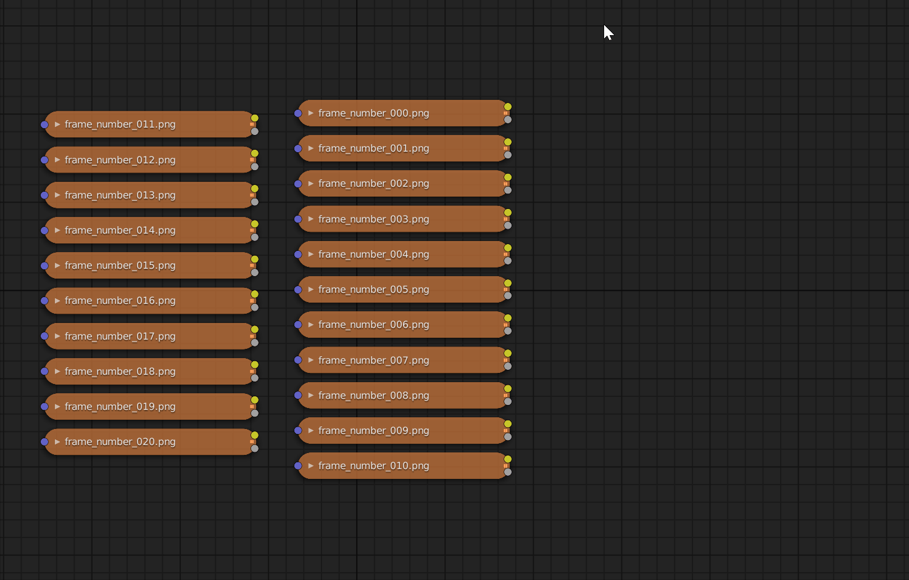
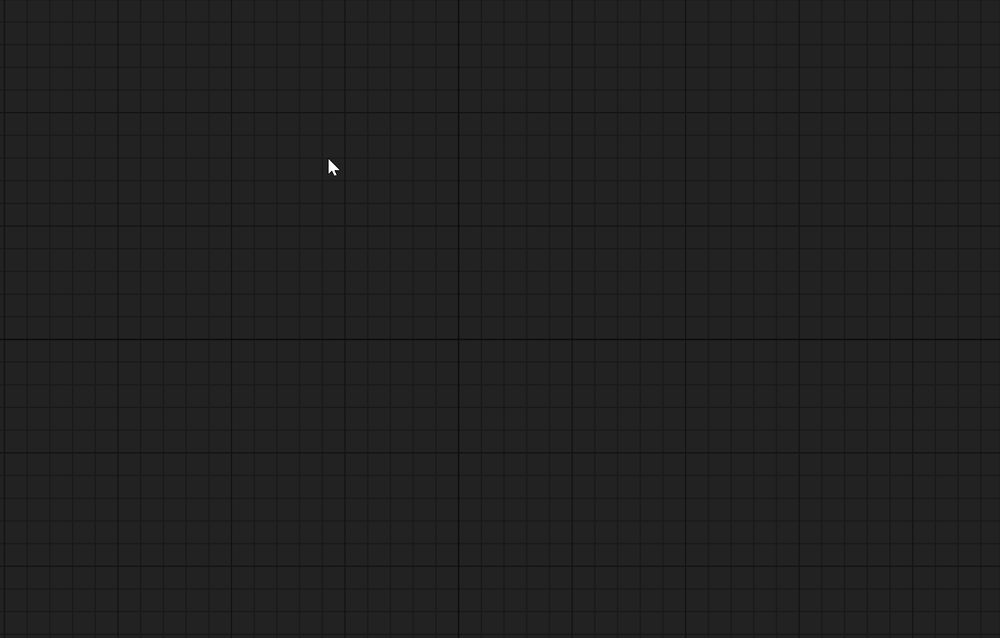

# Node Switcher Blender Addon
## Overview
Blender addon for generating node networks to switch and/or blend between various
datatypes.

Currently supports all shader socket types used by Cycles/Eevee with plans to support other render engines in future.

## Updates
| Date | Version | Summary |
| - | - | - |
| Oct 12th, 2021 | 0.2 | ID Key with Auto detect |
| Sept 8th, 2021 | 0.1 | First Release |

## Switch Types
#### ID/RGB Switcher.  
Switching based on the colors of an input with auto detection for image input.  
<iframe width="560" height="400" src="https://www.youtube.com/embed/ZFIZPFnB7xc" title="ID Key Demo" frameborder="0" allow="accelerometer; autoplay; clipboard-write; encrypted-media; gyroscope; picture-in-picture" allowfullscreen></iframe>  

<!-- <iframe width="560" height="315" src="https://www.youtube.com/embed/ZFIZPFnB7xc" title="YouTube video player" frameborder="0" allow="accelerometer; autoplay; clipboard-write; encrypted-media; gyroscope; picture-in-picture" allowfullscreen></iframe>   -->

#### Hard Switcher:
Hard value based switching for arbitrary uniform socket types.  
{: style="width:400px"}  

#### Soft Switcher:
Blended value based switching for arbitrary uniform socket types.  
{: style="width:400px"}  

#### Weighted average switch:
Create a node network that calculates a weighted overage of the inputs. Not compatible with shader socket types.  
{: style="width:400px"}  

## Parameters
### ID Key from Selected  
{: style="width:400px"}  

**Important**: High value resolution and low sample intervals rarely improve color detection but will greatly increase node creation time.  

* Value Resolution: The color depth to use for sampling.
* Sample Interval: The spatial interval to use for sampling. Eg. A sample of 4 means a 1024x1024 image will be processed as 256x256
* ID Limit: The maximum number of IDs that will be output. Use a higher value than you need to account for noise, backgrounds, and padding.
* Socket Type: The socket types to be used for switch inputs.
### ID Switch node  

{: style="height:400px"}  

* Result: The switched result  
* Mask 0..: The keying results as individual masks
* ID Map: ID Map (or other color input) to key.
* Tolerance: Tolerance of the keying. Increase make the keying colors less strict
* Gamma: Gamma of each mask. The contrast of each internal masking operation.
### New Switcher From Selected  

{: style="width:400px"}  

* Socket Type: Tolerance of the keying. Increase make the keying colors less strict
* Switch Type: Method of switching. See [switching types](#switch-types) section for more details.

## New Node Groups
* Value Lerp
Linear interpolation of a value.
* Vector Lerp
Linear interpolation of a vector.
* Switch Node
Primary addon function, the different switch nodes,
* RGB Key
Color keyer node. Create a mask of the ID Map input using the Key color.
* ID Switcher
Color based switching and mask generation based on the colors of an input.

## Usage
### Tutorial: Create Switcher for ID Map
Select and image node containing the id map to be switched. Open the context menu (default: Right Click) and select "ID Switcher for Selected".

<iframe width="560" height="400" src="https://www.youtube.com/embed/ZFIZPFnB7xc" title="YouTube video player" frameborder="0" allow="accelerometer; autoplay; clipboard-write; encrypted-media; gyroscope; picture-in-picture" allowfullscreen></iframe>  

### Tutorial: Adding a Switcher For Selected

After selecting the nodes whose sockets you want to switch. Right click in an empty space and select "New Switcher For Selected Nodes". An operator will pop-up on which you can select the socket type to use for switching and a switching mode. See addon overview full descriptions of node switches.

### Tutorial: Adding a New Switcher

The switcher node is available under the add nodes menu. Selection will trigger a pop-up on which you can can select the number of input sockets and the type of switch to create.

### Tutorial: Adding Bonus Nodes
All new nodes can be found in the add nodes menu under 'Converter'
